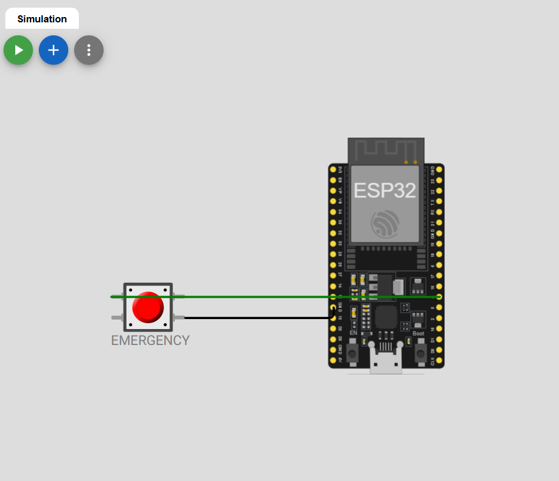
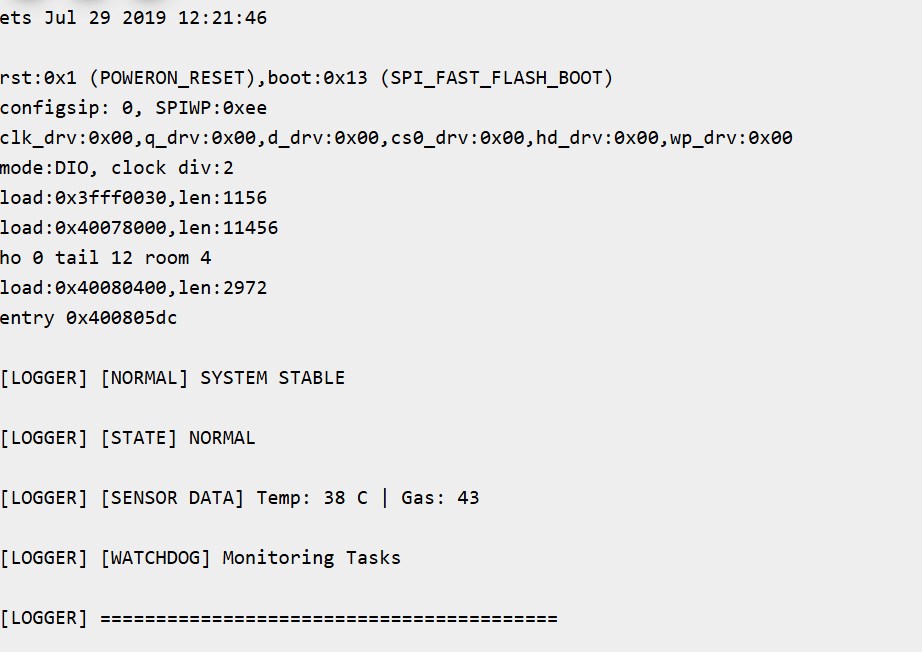
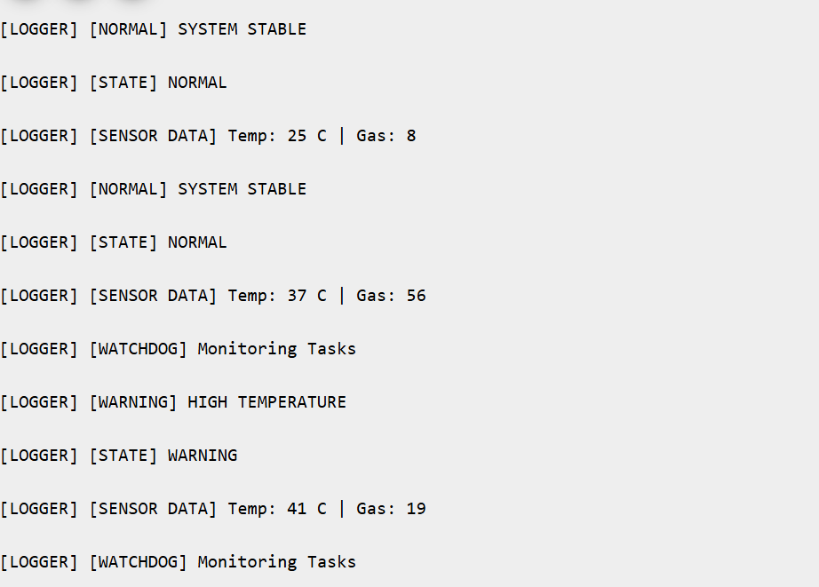
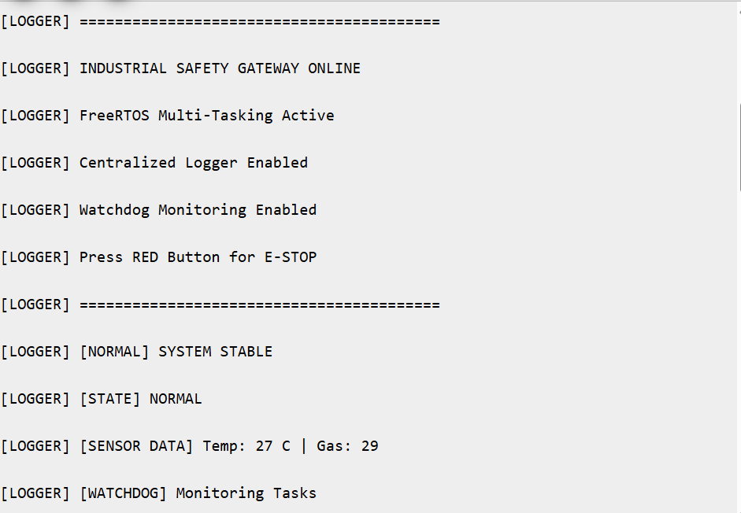
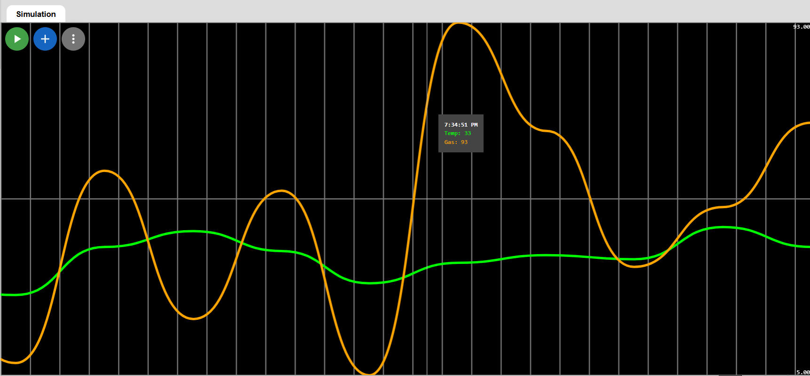

# ESP32 Industrial Safety Gateway using FreeRTOS

## Overview

This project implements a real-time Industrial Safety Gateway using ESP32 and FreeRTOS in the Wokwi simulation environment.

The firmware demonstrates industrial embedded software concepts including:

- interrupt-driven emergency handling
- FreeRTOS task scheduling
- queue-based inter-task communication
- watchdog supervision
- centralized logging
- fail-safe system architecture

The system continuously monitors simulated industrial sensor data and reacts to abnormal operating conditions using real-time event-driven firmware logic.

---

# System Features

## FreeRTOS Multi-Tasking Architecture

The firmware is built using multiple concurrent FreeRTOS tasks.

| Task Name | Function |
|------------|------------|
| Sensor Task | Simulates temperature and gas sensor acquisition |
| Safety Task | Handles system monitoring and emergency events |
| Logger Task | Centralized asynchronous logging |
| Watchdog Task | Supervises task execution health |

---

# Emergency Stop (E-STOP) using Hardware Interrupts

A pushbutton connected to GPIO4 acts as an Emergency Stop trigger.

When pressed:

- GPIO interrupt is generated
- ISR executes immediately
- Binary semaphore signals the Safety Task
- System transitions into FAIL-SAFE mode
- Non-critical tasks are halted

This demonstrates low-latency interrupt-driven embedded firmware behavior used in industrial systems.

---

# System States

The firmware operates using four system states:

| State | Description |
|------|-------------|
| NORMAL | Safe operating condition |
| WARNING | High temperature detected |
| CRITICAL | Gas leak detected |
| ESTOP | Emergency stop activated |

---

# Sensor Monitoring

The Sensor Task periodically generates simulated industrial sensor values:

- Temperature Sensor
- Gas Leakage Sensor

The Safety Task evaluates incoming data and performs real-time state transitions.

---

# Fail-Safe System Design

When Emergency Stop is activated:

- system enters ESTOP state
- sensor task is suspended
- normal monitoring stops
- fail-safe mode is activated
- watchdog supervision continues

This behavior mimics industrial safety firmware architectures.

---

# Queue-Based Logging Architecture

A centralized logger task is implemented using FreeRTOS queues.

Benefits include:

- asynchronous logging
- task-safe console output
- scalable firmware debugging
- reduced resource contention

---

# Watchdog Supervision

The Watchdog Task continuously monitors task heartbeat activity.

Monitored Tasks:

- Sensor Task
- Safety Task
- Logger Task

If heartbeat timeout occurs:

- watchdog fault is detected
- recovery notification is generated

This demonstrates basic firmware fault supervision concepts.

---

# Technologies Used

| Technology | Purpose |
|------------|---------|
| ESP32 | Embedded controller |
| ESP-IDF | Firmware framework |
| FreeRTOS | Real-time operating system |
| Embedded C | Firmware implementation |
| GPIO Interrupts | Emergency stop handling |
| Queues | Inter-task communication |
| Binary Semaphores | ISR-to-task synchronization |
| Wokwi | Hardware simulation platform |

---

# Hardware Configuration

## Components

- ESP32 DevKit V4
- Pushbutton Switch

---

## GPIO Mapping

| Component | GPIO |
|-----------|------|
| Emergency Stop Button | GPIO4 |

---

# Hardware Setup

ESP32 GPIO4 is connected to a pushbutton configured as an interrupt-triggered Emergency Stop input.



---

# Software Architecture

## Firmware Flow

1. Sensor Task generates sensor data
2. Sensor values are sent using FreeRTOS queues
3. Safety Task evaluates system conditions
4. Logger Task handles asynchronous logging
5. Watchdog Task supervises firmware execution
6. ISR handles emergency stop interrupts

---

# Project Structure

```text
esp32-industrial-safety-gateway/
│
├── main.c
├── diagram.json
├── README.md
│
├── assets/
│   ├── hardware_setup.png
│   ├── startup_output.png
│   ├── normal_operation.png
│   ├── critical_estop.png
│   ├── sensor_monitoring_graph.png
```

---

# Simulation Outputs

## System Startup



---

## Normal System Operation



---

## Emergency Stop Activation



---

## Sensor Monitoring Graph



---

# Example Console Output

```text
[CRITICAL] EMERGENCY STOP ACTIVATED
[SYSTEM] FAIL-SAFE MODE ACTIVE
[STATUS] SYSTEM LOCKED
[SAFETY TASK] NON-CRITICAL TASKS HALTED
[SYSTEM] SAFE STATE ACHIEVED
```

---

# Key Embedded Concepts Demonstrated

- Interrupt Service Routine (ISR)
- Real-Time Task Scheduling
- Binary Semaphores
- Queue-Based Communication
- Watchdog Monitoring
- Fail-Safe State Management
- Embedded State Machines
- Centralized Logging Architecture
- Industrial Firmware Supervision

---

# Future Improvements

Potential future extensions:

- MQTT cloud integration
- OTA firmware updates
- LCD/OLED status display
- SD card logging
- Modbus/CAN communication
- Real sensor interfacing
- RTOS performance profiling
- Persistent fault diagnostics

---

# Wokwi Simulation

Project simulation can be executed directly in Wokwi.

Add your project link here:

```text
https://wokwi.com/projects/463828079360334849
```

---

# Author

Sindhu Hegde

Embedded Systems | Firmware Development | Real-Time Systems
